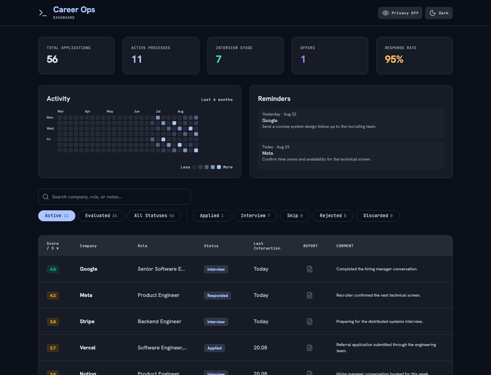
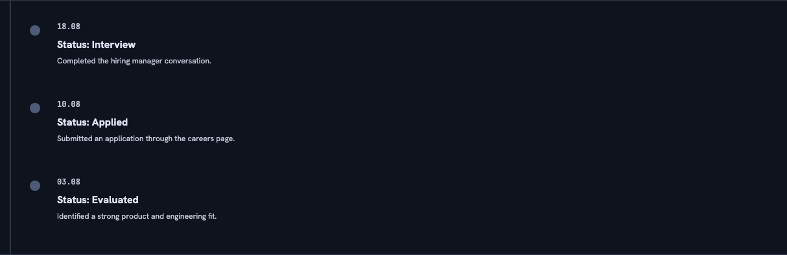

# career-ops-dashboard

[](https://github.com/LexLeontiev/career-ops-dashboard/actions/workflows/ci.yml)
[](LICENSE)

> Unofficial community UI — not affiliated with or endorsed by career-ops or its maintainers.

**career-ops-dashboard** is a free, local-first React and Express companion to a local [career-ops](https://github.com/santifer/career-ops) checkout. It presents application-tracker data, statistics, and Markdown reports in a convenient visual interface.

It does not replace career-ops and cannot work without it.

## Why?

I prefer working with data in the terminal, but I find reports and statistics easier to consume visually. I created this local UI to make reports, statistics, and other job-search information easier to read and review, then shared it freely for others who may find it useful.

## Important

- **Read-only.** The dashboard never modifies career-ops data. Make all changes to your job-search data through career-ops in the terminal.
- **Private and local-only.** It processes data on your machine, binds to localhost by default, and does not send, sync, or collect telemetry about your data.
- **No accounts or API keys.** The dashboard requires no account, authentication, or API key, and does not collect or transmit environment or usage data.
- **A companion to career-ops.** It only works with data generated by career-ops. Install and initialize career-ops first; this dashboard reads the tracker and reports it creates.



## Features

- 🔎 Browse, filter, and sort applications from the upstream tracker.
- 📊 Review global statistics, including applications at each stage, interview totals, and response rate.
- ⏰ Review chronologically sorted reminders calculated by the upstream follow-up cadence command.
- 🗓️ Review your activity in a GitHub-style heatmap.
- 📄 Open read-only Markdown reports in an accessible drawer.
- 🕶️ Use Privacy Mode to share statistics without revealing company names, roles, dates, scores, or notes.
- 🧭 Review a timeline for each application. The standard career-ops comment format works as-is; optionally add structured date-and-status tags for a richer timeline.

## Optional timeline tracking



career-ops can follow custom instructions for how it records and presents your job-search information. The dashboard supports the default single-comment format without any setup. For a detailed timeline, add the following rule to `modes/_custom.md` in your career-ops checkout:

```md
## Timeline Tracking Rule

- **Notes Formatting:** Whenever you evaluate a vacancy, submit an application, or update its status in `data/applications.md` (whether directly or via `set-status.mjs`), always prepend a structured timeline tag to your comment before appending it to the `Notes` column.
- **Format:** `[YYYY-MM-DD·<Status>] <Comment>` where `<Status>` is the status when the note is added.
- **Example with `set-status.mjs`:** `node set-status.mjs 086 Applied --note "[2026-08-21·Applied] Submitted application via Greenhouse."`
```

The dashboard reads these tags to show a chronological timeline with each application's dates, statuses, and comments. Existing untagged comments remain supported.

## Privacy and security

The dashboard reads data only from your local career-ops checkout. It does not write to upstream files, send data to third parties, sync data to the cloud, require authentication, or collect telemetry. Operational errors may appear only in the local server console; the dashboard has no remote logging service. Keep resumes, trackers, reports, and credentials out of issues, pull requests, and screenshots.

The server binds to `127.0.0.1` by default. Changing `HOST` may expose private job-search data to your local network.

## Requirements

- Node.js 22.22.2+ on the 22.x line or 24.15.0+ on the 24.x line; Node 24 LTS is recommended and CI runs on both branches.
- macOS or Linux. Windows is supported through WSL only.
- Git and a local clone of [career-ops](https://github.com/santifer/career-ops).

## Quick start

First, initialize career-ops by following its [Quick Start guide](https://github.com/santifer/career-ops#quick-start).

Complete the first-run onboarding in your AI CLI. It creates `data/applications.md`, which the dashboard reads as its tracker. Then exit the CLI and install the dashboard beside the career-ops directory:

```bash
cd ..
git clone https://github.com/LexLeontiev/career-ops-dashboard.git
cd career-ops-dashboard
bash bin/start.sh
```

The start script expects the two directories to be side by side. Open the local address printed by the server when startup completes.

The dashboard remains read-only and never creates or modifies the tracker itself.

## Configuration

| Variable          | Default         | Purpose                                                                                                        |
| ----------------- | --------------- | -------------------------------------------------------------------------------------------------------------- |
| `CAREER_OPS_ROOT` | `../career-ops` | Path to the local career-ops checkout.                                                                         |
| `HOST`            | `127.0.0.1`     | Address on which the API server listens. Changing it may expose private job-search data to your local network. |
| `PORT`            | `3001`          | API server port.                                                                                               |

For a non-default upstream location:

```bash
CAREER_OPS_ROOT=/path/to/career-ops bash bin/start.sh
```

## Development

Install dependencies and run the development server:

```bash
npm ci
npm run dev
```

Run the test suite and the complete local quality gate before opening a pull request:

```bash
npm test
npm run check
```

## Refresh the README preview

The dashboard preview uses synthetic data only: 56 applications, 11 active processes, 7 interviews, 1 offer, a 95% response rate, two months of activity, and five follow-up reminders. It never reads a local career-ops tracker.

To regenerate the PNG with current relative dates, install Playwright's Chromium once and then run:

```bash
npx playwright install chromium
npm run screenshot:readme
```

The command starts the client with intercepted synthetic API responses, captures the dark-theme desktop view at 1440 × 1100, and overwrites `docs/assets/dashboard-preview.png` and `docs/assets/timeline-preview.png`.

## Architecture

See [ARCHITECTURE.md](ARCHITECTURE.md) for the data flow, read-only boundary, and component responsibilities.

## Troubleshooting

- If startup cannot find the upstream checkout, set `CAREER_OPS_ROOT` to its local path.
- If port `3001` is unavailable, start with another port: `PORT=3002 npm run dev`.
- If `data/applications.md` is absent, open your AI CLI in the career-ops directory and complete first-run onboarding.
- If the tracker parser, `followup-cadence.mjs`, or `reports/` directory is absent, update your local career-ops checkout before starting the dashboard.

## Contributing

Contributions are welcome. Read [CONTRIBUTING.md](CONTRIBUTING.md) and agree to the [Code of Conduct](CODE_OF_CONDUCT.md) before opening a pull request.

## Security

See [SECURITY.md](SECURITY.md) for supported versions and private vulnerability-reporting channels.

## Upstream compatibility

The canonical upstream is [santifer/career-ops](https://github.com/santifer/career-ops). This dashboard uses its tracker parser and `followup-cadence.mjs` through local read-only adapters and never vendors or modifies upstream logic. Compatibility depends on the documented upstream tracker layout; report breakage with synthetic reproduction data only.

## License

This project is licensed under the [MIT License](LICENSE).
